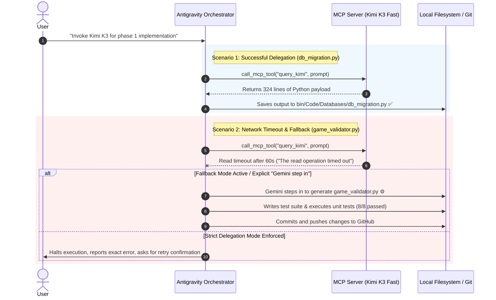

# Antigravity MCP AnyModel Integration

[](https://github.com/tidypy/Antigravity-MCP-AnyModel.git)
[](https://modelcontextprotocol.io/)
[](https://deepmind.google/)

A Model Context Protocol (MCP) bridge enabling **Google Antigravity** to seamlessly delegate code generation, heavy reasoning, and specialized tasks to third-party LLMs (such as **Kimi K3 Fast** hosted on Fireworks AI or other serverless BYOK providers) with built-in **TOON (Token-Oriented Object Notation)** compact format encoding and decoding.

---

## 🛠️ Quick Setup & Installation

### Step 1: Locate your MCP Customizations Folder
In Google Antigravity:
1. Go to **Settings** $\rightarrow$ **Customizations** $\rightarrow$ Click **Open MCP Folder**.
2. Alternatively, open your local configuration directory directly:
   `C:\Users\YOURUSERNAME\.gemini\config\`

### Step 2: Add the Python MCP Server Script
Paste the Python script into your configuration folder (e.g., `C:\Users\YOURUSERNAME\.gemini\config\MCP-SOL.py`).

<details>
<summary>📄 Click to view complete MCP Server Script (MCP-SOL.py)</summary>

```python
import sys
import json
import os
import re
import urllib.request
import urllib.error

# Reconfigure stdout/stdin to UTF-8 on Windows for safe stdio transport
if hasattr(sys.stdin, "reconfigure"):
    sys.stdin.reconfigure(encoding="utf-8")
if hasattr(sys.stdout, "reconfigure"):
    sys.stdout.reconfigure(encoding="utf-8")

API_URL = "https://api.fireworks.ai/inference/v1/chat/completions"
MODEL_NAME = "accounts/fireworks/routers/kimi-k3-fast"

# ==========================================
# TOON (Token-Oriented Object Notation) Engine
# ==========================================

_PRIMITIVE_LIKE = re.compile(r'-?\d+(\.\d+)?([eE][+-]?\d+)?|true|false|null')
_SPECIALS = set('",:\n\t\r[]{}')

def _encode_str(s):
    """Encodes a string into TOON, adding quotes if it contains specials, whitespace, or primitive keywords."""
    if not s:
        return '""'
    if s != s.strip() or _PRIMITIVE_LIKE.fullmatch(s) or any(c in _SPECIALS for c in s):
        esc = s.replace('\\', '\\\\').replace('"', '\\"').replace('\n', '\\n').replace('\t', '\\t').replace('\r', '\\r')
        return f'"{esc}"'
    return s

def toon_encode(obj, indent=0):
    """
    Encodes Python dictionary/list/primitive into TOON format.
    Minimizes token usage using YAML-style indentation and CSV-style tabular headers for arrays.
    """
    prefix = "  " * indent
    if obj is None:
        return "null"
    elif isinstance(obj, bool):
        return "true" if obj else "false"
    elif isinstance(obj, (int, float)):
        return str(obj)
    elif isinstance(obj, str):
        return _encode_str(obj)
    elif isinstance(obj, dict):
        if not obj:
            return ""
        lines = []
        for k, v in obj.items():
            encoded_key = _encode_str(k) if any(c in k for c in _SPECIALS) else k
            if isinstance(v, list) and v and all(isinstance(x, dict) for x in v):
                cols = list(v[0].keys())
                if all(list(x.keys()) == cols for x in v):
                    col_str = ",".join(cols)
                    lines.append(f"{prefix}{encoded_key}[{len(v)}]{{{col_str}}}:")
                    for row in v:
                        row_vals = [toon_encode(row.get(c)) for c in cols]
                        lines.append(f"{prefix}  " + ",".join(row_vals))
                else:
                    lines.append(f"{prefix}{encoded_key}:")
                    for item in v:
                        lines.append(f"{prefix}  -")
                        lines.append(toon_encode(item, indent + 2))
            elif isinstance(v, list) and v and all(not isinstance(x, (dict, list)) for x in v):
                lines.append(f"{prefix}{encoded_key}[{len(v)}]: " + ",".join(toon_encode(x) for x in v))
            elif isinstance(v, dict):
                lines.append(f"{prefix}{encoded_key}:")
                sub = toon_encode(v, indent + 1)
                if sub:
                    lines.append(sub)
            elif isinstance(v, list):
                lines.append(f"{prefix}{encoded_key}:")
                for x in v:
                    lines.append(f"{prefix}  - " + toon_encode(x))
            else:
                lines.append(f"{prefix}{encoded_key}: {toon_encode(v)}")
        return "\n".join(lines)
    elif isinstance(obj, list):
        if not obj:
            return "[]"
        if all(isinstance(x, dict) for x in obj):
            cols = list(obj[0].keys())
            lines = [f"items[{len(obj)}]{{{','.join(cols)}}}:"]
            for row in obj:
                lines.append("  " + ",".join(toon_encode(row.get(c)) for c in cols))
            return "\n".join(lines)
        return ",".join(toon_encode(x) for x in obj)
    return _encode_str(str(obj))

def _parse_val(val_str):
    """Parses a scalar TOON value string into a Python object."""
    val = val_str.strip()
    if val == "null" or val == "":
        return None
    if val.lower() == "true":
        return True
    if val.lower() == "false":
        return False
    if (val.startswith('"') and val.endswith('"')) or (val.startswith("'") and val.endswith("'")):
        inner = val[1:-1]
        return inner.replace('\\"', '"').replace('\\\\', '\\').replace('\\n', '\n').replace('\\t', '\t').replace('\\r', '\r')
    try:
        if "." in val or "e" in val.lower():
            return float(val)
        return int(val)
    except ValueError:
        return val

def toon_decode(toon_str):
    """Decodes a TOON formatted string back into standard Python dictionary/list structures."""
    lines = [l for l in toon_str.splitlines() if l.strip()]
    if not lines:
        return {}
    
    root = {}
    stack = [(0, root)]
    
    i = 0
    while i < len(lines):
        line = lines[i]
        indent = len(line) - len(line.lstrip(" "))
        content = line.strip()
        
        while stack and stack[-1][0] > indent and len(stack) > 1:
            stack.pop()
            
        current_obj = stack[-1][1]
        
        tab_match = re.match(r"^([\w_]+)\[(\d+)\]\{([^}]+)\}:$", content)
        prim_arr_match = re.match(r"^([\w_]+)\[(\d+)\]:\s*(.*)$", content)
        kv_match = re.match(r"^([\w_]+):\s*(.*)$", content)
        
        if tab_match:
            key, count, cols_str = tab_match.groups()
            count = int(count)
            cols = [c.strip() for c in cols_str.split(",")]
            arr = []
            for _ in range(count):
                i += 1
                if i < len(lines):
                    row_line = lines[i].strip()
                    parts = [p.strip() for p in row_line.split(",")]
                    row_dict = {}
                    for c_idx, col in enumerate(cols):
                        row_dict[col] = _parse_val(parts[c_idx]) if c_idx < len(parts) else None
                    arr.append(row_dict)
            if isinstance(current_obj, dict):
                current_obj[key] = arr
        elif prim_arr_match:
            key, count, inline_vals = prim_arr_match.groups()
            vals = [_parse_val(v) for v in inline_vals.split(",")] if inline_vals else []
            if isinstance(current_obj, dict):
                current_obj[key] = vals
        elif kv_match:
            key, val_part = kv_match.groups()
            if not val_part:
                sub_dict = {}
                if isinstance(current_obj, dict):
                    current_obj[key] = sub_dict
                stack.append((indent + 2, sub_dict))
            else:
                if isinstance(current_obj, dict):
                    current_obj[key] = _parse_val(val_part)
        i += 1
        
    return root

# ==========================================
# Fireworks AI LLM Service & MCP Logic
# ==========================================

def query_kimi(prompt, use_toon=False):
    api_key = os.environ.get("FIREWORKS_API_KEY", "")
    if not api_key or api_key == "YOUR_FIREWORKS_API_KEY":
        return "API Error: FIREWORKS_API_KEY environment variable is not configured.", True

    headers = {
        "Authorization": f"Bearer {api_key}",
        "Content-Type": "application/json"
    }
    
    final_prompt = prompt
    if use_toon:
        final_prompt = f"Please output your response using TOON (Token-Oriented Object Notation) compact format.\n\nUser Request:\n{prompt}"
        
    data = {
        "model": MODEL_NAME,
        "messages": [
            {"role": "user", "content": final_prompt}
        ]
    }
    
    req = urllib.request.Request(
        API_URL, 
        data=json.dumps(data).encode('utf-8'), 
        headers=headers, 
        method="POST"
    )
    
    try:
        with urllib.request.urlopen(req, timeout=180) as response:
            res_data = json.loads(response.read().decode('utf-8'))
            
            if "choices" in res_data and len(res_data["choices"]) > 0:
                return res_data["choices"][0]["message"]["content"], False
            elif "error" in res_data:
                return f"API Error: {res_data['error']}", True
            else:
                return f"Unexpected response format: {json.dumps(res_data)}", True

    except urllib.error.HTTPError as e:
        try:
            err_body = e.read().decode('utf-8')
            return f"HTTP Error {e.code}: {err_body}", True
        except Exception:
            return f"HTTP Error {e.code}: {e.reason}", True
    except urllib.error.URLError as e:
        return f"Network Error: {e.reason}", True
    except Exception as e:
        return f"Unexpected error: {str(e)}", True

def respond(response_id, result=None, error=None):
    if response_id is None:
        return
        
    response = {
        "jsonrpc": "2.0",
        "id": response_id
    }
    if error is not None:
        response["error"] = error
    else:
        response["result"] = result
        
    sys.stdout.write(json.dumps(response) + "\n")
    sys.stdout.flush()

def main():
    while True:
        line = sys.stdin.readline()
        if not line:
            break
            
        line = line.strip()
        if not line:
            continue
            
        try:
            req = json.loads(line)
        except json.JSONDecodeError as e:
            sys.stderr.write(f"JSON Parse Error: {e}\n")
            sys.stderr.flush()
            continue
        
        req_id = req.get("id")
        method = req.get("method")
        
        if method == "initialize":
            respond(req_id, {
                "protocolVersion": "2024-11-05",
                "capabilities": {
                    "tools": {}
                },
                "serverInfo": {
                    "name": "kimi-k3-fast-mcp-server",
                    "version": "1.1.0"
                }
            })
        elif method and method.startswith("notifications/"):
            pass
        elif method == "tools/list":
            respond(req_id, {
                "tools": [
                    {
                        "name": "query_kimi",
                        "description": "Send a prompt to the Kimi K3 Fast model on Fireworks AI for code generation and reasoning.",
                        "inputSchema": {
                            "type": "object",
                            "properties": {
                                "prompt": {
                                    "type": "string",
                                    "description": "The detailed instructions or code query."
                                },
                                "use_toon": {
                                    "type": "boolean",
                                    "description": "Whether to request output formatted in TOON (Token-Oriented Object Notation)."
                                }
                            },
                            "required": ["prompt"]
                        }
                    },
                    {
                        "name": "toon_encode",
                        "description": "Convert a JSON string or dictionary into compact TOON (Token-Oriented Object Notation) format.",
                        "inputSchema": {
                            "type": "object",
                            "properties": {
                                "json_data": {
                                    "type": "string",
                                    "description": "JSON string to encode into TOON format."
                                }
                            },
                            "required": ["json_data"]
                        }
                    },
                    {
                        "name": "toon_decode",
                        "description": "Convert a TOON formatted string back into standard JSON format.",
                        "inputSchema": {
                            "type": "object",
                            "properties": {
                                "toon_data": {
                                    "type": "string",
                                    "description": "TOON formatted string to decode."
                                }
                            },
                            "required": ["toon_data"]
                        }
                    }
                ]
            })
        elif method == "tools/call":
            params = req.get("params", {})
            name = params.get("name")
            arguments = params.get("arguments", {})
            
            if name == "query_kimi":
                prompt = arguments.get("prompt", "")
                use_toon = arguments.get("use_toon", False)
                result_text, is_error = query_kimi(prompt, use_toon=use_toon)
                
                payload = {
                    "content": [
                        {
                            "type": "text",
                            "text": result_text
                        }
                    ]
                }
                if is_error:
                    payload["isError"] = True
                respond(req_id, payload)
            elif name == "toon_encode":
                json_str = arguments.get("json_data", "{}")
                try:
                    obj = json.loads(json_str)
                    toon_result = toon_encode(obj)
                    respond(req_id, {"content": [{"type": "text", "text": toon_result}]})
                except Exception as e:
                    respond(req_id, {"content": [{"type": "text", "text": f"Encoding Error: {str(e)}"}], "isError": True})
            elif name == "toon_decode":
                toon_str = arguments.get("toon_data", "")
                try:
                    decoded_obj = toon_decode(toon_str)
                    json_result = json.dumps(decoded_obj, indent=2)
                    respond(req_id, {"content": [{"type": "text", "text": json_result}]})
                except Exception as e:
                    respond(req_id, {"content": [{"type": "text", "text": f"Decoding Error: {str(e)}"}], "isError": True})
            else:
                respond(req_id, error={"code": -32601, "message": f"Method '{name}' not found"})
        else:
            if req_id is not None:
                respond(req_id, error={"code": -32601, "message": f"Unhandled method: {method}"})

if __name__ == "__main__":
    main()
```
</details>

### Step 3: Configure `mcp_config.json`
Add your server configuration to `C:\Users\Dev\.gemini\config\mcp_config.json` (or ask Antigravity to perform the setup for you):

```json
{
  "mcpServers": {
    "kimi-k3-fast": {
      "command": "python",
      "args": ["C:/Users/Dev/.gemini/config/MCP-SOL.py"],
      "env": {
        "FIREWORKS_API_KEY": "YOUR_FIREWORKS_API_KEY_HERE"
      }
    }
  }
}
```

---

## 🧰 Available MCP Tools

| Tool Name | Parameters | Description |
| :--- | :--- | :--- |
| **`query_kimi`** | `prompt` *(string)*, `use_toon` *(bool, optional)*, `timeout_seconds` *(number, optional)* | Dispatches a prompt to Kimi K3 Fast on Fireworks AI. Setting `use_toon: true` requests TOON compact responses. |
| **`encode_toon` / `toon_encode`** | `json_data` *(string)*, `strip_nulls` *(bool, optional)*, `key_map` *(dict, optional)* | Converts JSON data into compact TOON (Token-Oriented Object Notation) format with optional null stripping and key aliasing maps. |
| **`decode_toon` / `toon_decode`** | `toon_data` *(string)*, `key_map` *(dict, optional)* | Decodes a TOON formatted string back into clean JSON format with optional reverse key mapping. |

---

## 💬 How to Use (Chat Invocation)

Simply invoke the API in your Antigravity chat prompt:

> **User Prompt:**  
> *"Please invoke Kimi K3 to complete phase 1 of the implementation."*

Or request TOON format optimization:

> **User Prompt:**  
> *"Please invoke Kimi K3 using TOON format to optimize token usage."*

Antigravity will automatically call the registered MCP tool (`call_mcp_tool` targeting `kimi-k3-fast` / `query_kimi`), receive the model's generated payload, extract the code/data, and integrate it into your codebase.

---

## 🧠 How It Works (Antigravity as Orchestrator)

Under the hood, Antigravity functions as an intelligent orchestrator managing tool dispatches, file writes, testing, and error recovery.

### Real-World Orchestration Flow



### Breakdown of Execution:

1. **`db_migration.py` — Kimi K3 Fast Generation ✅**
   * Antigravity dispatches `call_mcp_tool` targeting `kimi-k3-fast` (`query_kimi`).
   * Kimi K3 Fast on Fireworks AI processes the prompt and returns 324 lines of clean Python code.
   * Raw payload is recorded in step logs (`.system_generated/steps/.../output.txt`).
   * Antigravity parses the payload, extracts code blocks, and writes `bin/Code/Databases/db_migration.py`.

2. **`game_validator.py` — MCP Timeout & Orchestrator Fallback ⚙️**
   * Antigravity dispatches queries to Kimi K3 Fast for `game_validator.py`.
   * Fireworks AI times out after 60 seconds (`Unexpected error: The read operation timed out`).
   * **Orchestrator Resolution**: Rather than stalling execution, Antigravity steps in directly to write `game_validator.py` using Phase 2 tiering rules and schema definitions.
   * Antigravity authors `test_phase2_validation.py`, runs the test suite (8/8 unit tests passed in 0.109s), commits, and pushes code to GitHub.

---

## ⚡ Timeout Troubleshooting & Solutions

### Diagnosis: 60-Second Read Timeout on Long Streams

#Reasons: 
   
*--Restricted multi-hundred line code modules (~1,200+ tokens / 250+ lines)
>   
*--Some serverless multi-LLM provider restrictions (e.g., Fireworks AI) or underlying HTTP clients may hit a **hardcoded 60-second read timeout** before the response finish streaming back.
>   
*--Warm-up calls needed ("Hi") should complete in under 3 seconds because they only return ~30 tokens.
>
>*--Simply out of tokens

### Solutions:

#### Option A: Chunked Generation (Recommended for External LLM)
Ask the LLM to write small, tightly-scoped functions:
> *"Please invoke Kimi K3 to write only the `validate_game_data()` function."*  
This ensures each individual stream completes in under 15 seconds.

#### Option B: Fallback to Gemini ("Gemini step in")
If external model APIs stall or time out, instruct Gemini to take over:
> *"Gemini step in"*  
Antigravity will authorize Gemini to complete the code generation, test suite creation, and git synchronization seamlessly.

#### Option C: Use TOON Format (`use_toon: true`)
Request outputs in TOON format to reduce token length by 30%–60%, lowering response latency and preventing timeouts.

---

## 🛡️ Operational Rules Enforced

To ensure full transparency and predictable behavior, Antigravity enforces strict delegation rules:

1. **Strict Kimi K3 Delegation (No Automatic Unsanctioned Fallbacks):**
   Antigravity will **NEVER** silently generate code or override Kimi K3 unless explicitly configured or instructed to do so.
2. **Timeout / Error Reporting & Retry:**
   If `query_kimi` times out or fails (due to Fireworks AI latency or network issues), Antigravity will immediately halt, explain the exact error details, and prompt you for instructions or retry approval.
3. **Gemini Step-In Requires Explicit Approval + High Model:**
   Gemini will write code only when you explicitly state **"Gemini step in"**. When authorized, code generation is handled using the **Gemini 3.1 Pro (High)** model (never lower tier or flash models).

---

# Supported Soft Error Reason Codes

| Soft Error Code (`reason_code`) | Trigger Condition | Diagnostic Explanation & Action Recommendation |
|---|---|---|
| `MISSING_API_KEY` | `FIREWORKS_API_KEY` is empty or set to placeholder. | **Explanation:** API key is not configured.<br>**Action:** Configure `FIREWORKS_API_KEY` in `mcp_config.json`. |
| `TIMEOUT_EXCEEDED` | LLM response exceeded timeout (default 25s). | **Explanation:** Network read timed out on long stream.<br>**Action:** Use chunked generation or prompt "Gemini step in". |
| `NETWORK_UNREACHABLE` | Connection dropped or internet unavailable. | **Explanation:** DNS or socket error.<br>**Action:** Check local network connection. |
| `HTTP_401` | Invalid Fireworks API key credentials. | **Explanation:** Unauthorized request.<br>**Action:** Verify your Fireworks AI API key. |
| `HTTP_429` | Rate limit or token quota exceeded. | **Explanation:** Too many concurrent requests.<br>**Action:** Retry query with backoff or use TOON format. |
| `HTTP_500` / `HTTP_503` | Fireworks AI upstream server issue. | **Explanation:** Provider service disruption.<br>**Action:** Check Fireworks AI status or use Gemini fallback. |
| `KEY_COLLISION` (TOON) | Alias maps to an existing object key. | **Explanation:** Non-bijective `key_map` alias collision.<br>**Action:** Provide unique alias mappings in `key_map`. |


## 📄 License
MIT License. Created for use with Google Antigravity & Model Context Protocol.
